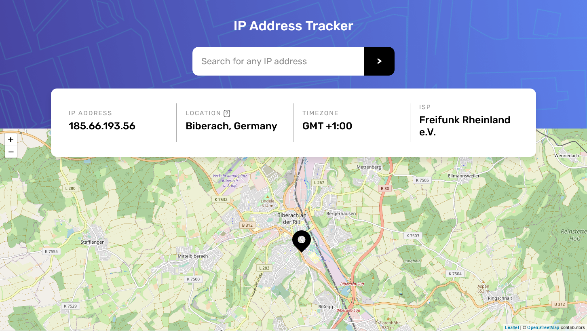

# IP Address Tracker

This is a solution to the [IP address tracker challenge on Frontend Mentor](https://www.frontendmentor.io/challenges/ip-address-tracker-I8-0yYAH0). Frontend Mentor challenges help to improve coding skills by building realistic projects.

## Table of contents

-   [Challenge](#challenge)
-   [Links](#links)
-   [Technologies](#technologies)
-   [Wokflow](#workflow)
-   [Sources](#sources)
-   [Screenshots](#screenshots)
-   [Author](#author)

## Challenge

Users should be able to:

-   View the optimal layout for each page depending on their device's screen size
-   See hover states for all interactive elements on the page
-   See their own IP address on the map on the initial page load
-   Search for any IP addresses or domains and see the key information and location

## Links

-   [Solution on Frontend Mentor](https://www.frontendmentor.io/solutions/react-scss-shrtcode-api-sessionstorage-clipboard-api-wbayhjxMP)
-   [Live website](https://tkulic.github.io/ip-address-tracker)
-   [GitHub repository](https://github.com/tkulic/ip-address-tracker)

## Technologies

-   HTML5
-   CSS3
-   Vanilla JavaScript
-   IP Geolocation API - [IPWHOIS.IO](https://ipwhois.io)
-   [Leaflet](https://leafletjs.com) library for generating interactive maps

## Workflow

1. Project initialization as a public repository on GitHub
2. Planning out HTML structure and CSS classes based on design files
3. Writing out HMTL and preparing it for DOM interactions with JavaScript
4. Styling the page from top to bottom by utilizing _mobile-first_ approach
5. Adding media queries for desktop layout
6. Integrating IP Geolocation into the script
7. Adding the interactive map and binding it to Geolocation data
8. Configuring repository to publish code with GitHub Pages

## Sources

-   [IPWHOIS.IO Docs](https://ipwhois.io/documentation#tabs-format)
-   [Leaflet Docs](https://leafletjs.com/reference-1.7.1.html)

## Screenshots

## Author

-   GitHub profile - [Toni Kulić](https://github.com/tkulic)
-   Frontend Mentor - [@tkulic](https://www.frontendmentor.io/profile/tkulic)
